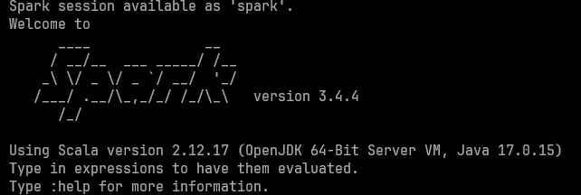

# Apache Spark Installation on Linux / WSL Ubuntu Server

Here are steps to install apache spark on Linux machine, including WSL.

### 1. Update System Packages
```bash
sudo apt update
```

### 2. Install Java Development Kit (JDK)
```bash
sudo apt install openjdk-17-jdk
```
Verify installation:
```bash
java -version
```

### 3. Download and Extract Apache Spark Package on Ubuntu
Go to https://spark.apache.org/downloads.html for more complete versions of Apache Spark. Here we will download version 3.4.4. You can put it in any desired place, but better to put in your root directory.

```bash
cd ~
wget https://archive.apache.org/dist/spark/spark-3.4.4/spark-3.4.4-bin-hadoop3.tgz
tar xvf spark-3.4.4-bin-hadoop3.tgz
```

### 4. Move to Spark Directory
```bash
sudo mv spark-3.4.4-bin-hadoop3 /opt/spark
```

### 5. Configure Some Environment Variables
Open the `.bashrc` file
```bash
nano ~/.bashrc 
```
Add these lines in the bottom of the file.
```bash
export SPARK_HOME=/opt/spark
export PATH=$PATH:$SPARK_HOME/bin
```
Save it and exit the editor. Reload the `.bashrc` file
```bash
source ~/.bashrc
```
### 6. Verify installation
Verify if the installation success with running spark shell.
```bash
spark-shell
```
It should show spark shell starting up like in this picture. You can also see the version of apache spark you have installed.
<div align="center">
  
</div>

## Additional

To access spark with its python client, `pyspark`, you can install it using pip in your venv. Don't forget to specify the pyspark version to avoid any version's mismatch problem.

```bash
pip install pyspark==3.4.4
```

## Source
[1] https://www.virtono.com/community/tutorial-how-to/how-to-install-apache-spark-on-ubuntu-22-04-and-centos/